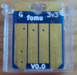
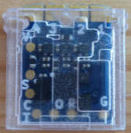
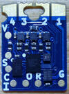
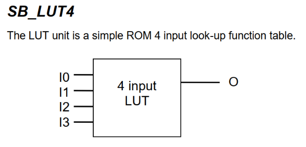
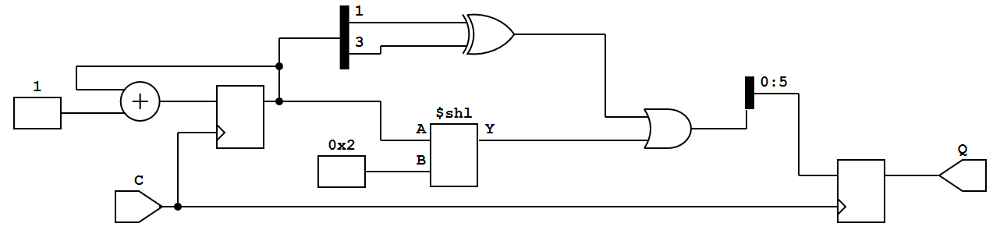
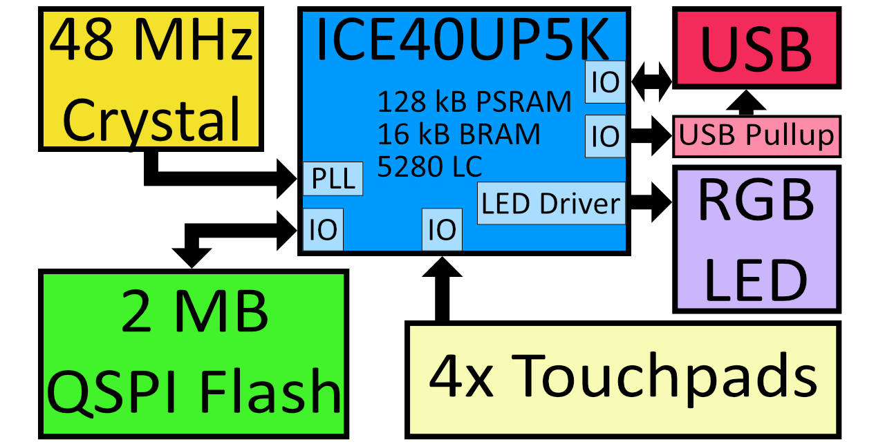
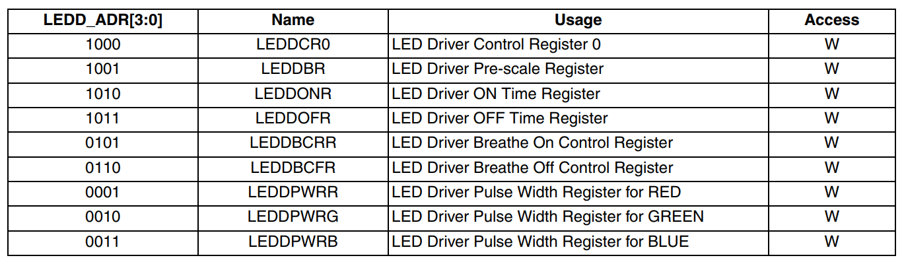
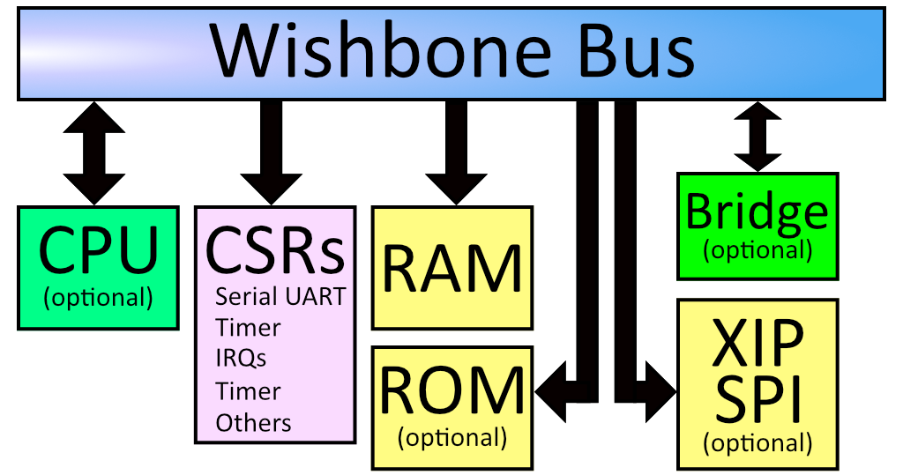
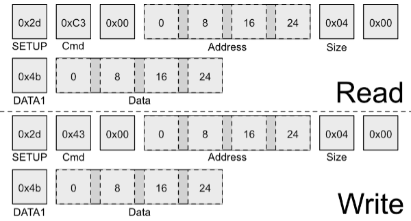
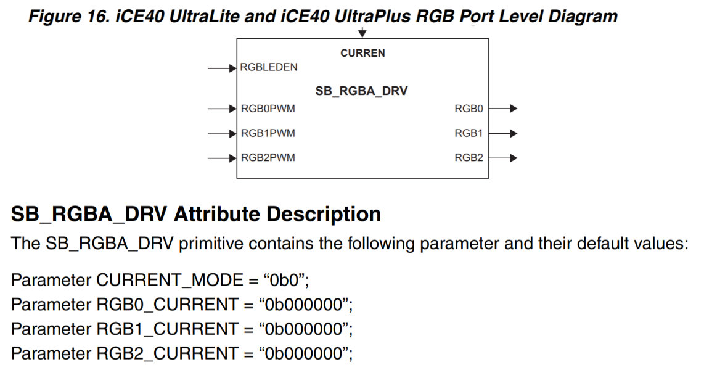

<style>
.inner {
  max-width: 90%;
}

blockquote {
  border: 1px solid black;
  margin: 1em;
  padding: 1em;
  background: #ffdc8d;
}
blockquote:before {
  font-size: larger;
  font-weight: bolder;
  font-variant: small-caps;
  content: "Extra Information";
}
h2 {
  margin-top: 4em;
}
</style>

# Fomu Workshop


Hi, I'm Fomu!  This workshop covers the basics of Fomu in a top-down approach.  We'll start out by learning what Fomu is, how to load software into Fomu, and finally how to write software for Fomu.

FPGAs are complex, weird things, so we'll take a gentle approach and start out by treating it like a Python interpreter first, and gradually peel away layers until we're writing our own hardware registers.  You can take a break at any time and explore!  Stop when you feel the concepts are too unfamiliar, or plough on and dig deep into the world of hardware.

## Table of Contents
* TOC
{:toc}


## Requirements

### Required Files

You will need the Workshop files.  They are located in the [fomu-workshop](https://github.com/im-tomu/fomu-workshop) Github repository.  You can download [master.zip](https://github.com/im-tomu/fomu-workshop/archive/master.zip) or clone it from git:

```
git clone --recurse-submodules https://github.com/im-tomu/fomu-workshop.git
```

If you're attending a workshop that provides USB drives, these files may be available on the USB drive under the `Workshop` directory.

### Required Software

Fomu requires specialized software. This software is provided for Linux x86/64, macOS, and Windows, via [Fomu Toolchain](https://github.com/im-tomu/fomu-toolchain/releases/latest).

Debian packages are also [available for Raspberry Pi](https://github.com/im-tomu/fomu-raspbian-packages).

If you're taking this workshop as a class, the toolchains are provided on the USB disk.

To install the software, extract it somewhere on your computer, then open up a terminal window and add that directory to your PATH:

* macOS: `export PATH=[path-to-toolchain]/bin:$PATH`
* Linux: `export PATH=[path-to-toolchain]/bin:$PATH`
* Windows Powershell: `$ENV:PATH = "[path-to-toolchain]\bin;" + $ENV:PATH`
* Windows cmd.exe: `PATH=[path-to-toolchain]\bin;%PATH%`

To confirm installation, run the `yosys` command and confirm you get the following output;
```sh
$ yosys

 /----------------------------------------------------------------------------\
 |                                                                            |
 |  yosys -- Yosys Open SYnthesis Suite                                       |
 |                                                                            |
 |  Copyright (C) 2012 - 2018  Clifford Wolf <clifford@clifford.at>           |
 |                                                                            |
 |  Permission to use, copy, modify, and/or distribute this software for any  |
 |  purpose with or without fee is hereby granted, provided that the above    |
 |  copyright notice and this permission notice appear in all copies.         |
 |                                                                            |
 |  THE SOFTWARE IS PROVIDED "AS IS" AND THE AUTHOR DISCLAIMS ALL WARRANTIES  |
 |  WITH REGARD TO THIS SOFTWARE INCLUDING ALL IMPLIED WARRANTIES OF          |
 |  MERCHANTABILITY AND FITNESS. IN NO EVENT SHALL THE AUTHOR BE LIABLE FOR   |
 |  ANY SPECIAL, DIRECT, INDIRECT, OR CONSEQUENTIAL DAMAGES OR ANY DAMAGES    |
 |  WHATSOEVER RESULTING FROM LOSS OF USE, DATA OR PROFITS, WHETHER IN AN     |
 |  ACTION OF CONTRACT, NEGLIGENCE OR OTHER TORTIOUS ACTION, ARISING OUT OF   |
 |  OR IN CONNECTION WITH THE USE OR PERFORMANCE OF THIS SOFTWARE.            |
 |                                                                            |
 \----------------------------------------------------------------------------/

 Yosys 78b30bbb1102047585d1a2eac89b1c7f5ca7344e (Fomu build) (git sha1 41d9173, gcc 5.5.0-12ubuntu1~14.04 -fPIC -Os)


yosys>
```

Ensure it says **(Fomu build)**.  Type `exit` to quit `yosys`.

> The [Fomu Toolchain](https://github.com/im-tomu/fomu-toolchain/releases/latest) consists of the following tools;
>
> | Tool | Purpose |
> | ---- |------------------ |
> | **[yosys](https://github.com/YosysHQ/yosys)** | Verilog synthesis |
> | **[nextpnr-ice40](https://github.com/YosysHQ/nextpnr)** | FPGA place-and-route |
> | **[icestorm](https://github.com/cliffordwolf/icestorm)** | FPGA bitstream packing |
> | **[riscv toolchain](https://www.sifive.com/boards/)** | Compile code for a RISC-V softcore |
> | **[dfu-util](https://dfu-util.sourceforge.net/)** | Load a bitstream or code onto Fomu |
> | **[python](https://python.org/)** | Convert Migen/Litex code to Verilog |
> | **[wishbone-tool](https://github.com/xobs/wishbone-utils/)** | Interact with Fomu over USB |
> | **serial console** | Interact with Python over a virtual console |


### Required Hardware

For this workshop, you will need a Fomu board. This workshop may be competed with any model of Fomu, though there are some parts that require you to identify which model you have:

1. **Fomu EVT3**: This model of Fomu is about the size of a credit card. It should have the text "Fomu EVT3" written across it in white silkscreen. If you have a different EVT board such as EVT2 or EVT1, they should work also.
1. **Fomu PVT1**: If you ordered a Fomu from Crowd Supply, this is the model you'll receive. It is small, and fits in a USB port. There is no silkscreen on it. This model of Fomu has a large silver crystal oscillator that is the tallest component on the board.
1. **Fomu Hacker**: These are the original design and are easiest to manufacture. If you received one directly from Tim, you probably have one of these. Hacker boards have white silkscreen on the back.
   
   
   

Your Fomu should be running Foboot v1.8.7 or newer. You can see what version you are running by typing `dfu-util -l` and noting the version number.

Aside from that, you need a computer with a USB port that can run the toolchain software. You should not need any special drivers, though on Linux you may need sudo access, or special udev rules to grant permission to use the USB device from a non-privileged account.

## Background

### About FPGAs

Field Programmable Gate Arrays (FPGAs) are arrays of gates that are programmable in the field.  Unlike most chips you will encounter, which have transistor gates arranged in a fixed order, FPGAs can change their configuration by simply loading new code.  Fundamentally, this code programs lookup tables which form the basic building blocks of logic.

These lookup tables (called LUTs) are so important to the design of an FPGA that they usually form part of the name of the part.  For example, Fomu uses a UP5K, which has about 5000 LUTs.  NeTV used an LX9, which had about 9000 LUTs, and NeTV2 uses a XC7A35T that has about 35000 LUTs.



This is the `SB_LUT4`, which is the basic building block of Fomu.  It has four inputs and one output.  To program Fomu, we must define what each possible input pattern will create on the output.

To do this, we turn to a truth table:

|      | 0 | 1 | 2 | 3 | 4 | 5 | 6 | 7 | 8 | 9 | 10 | 11 | 12 | 13 | 14 | 15 |
| ---- |---|---|---|---|---|---|---|---|---|---|----|----|----|----|----|----|
| IO0  | 0 | 0 | 0 | 0 | 0 | 0 | 0 | 0 | 1 | 1 | 1  | 1  | 1  | 1  | 1  | 1  |
| IO1  | 0 | 0 | 0 | 0 | 1 | 1 | 1 | 1 | 0 | 0 | 0  | 0  | 1  | 1  | 1  | 1  |
| IO2  | 0 | 0 | 1 | 1 | 0 | 0 | 1 | 1 | 0 | 0 | 1  | 1  | 0  | 0  | 1  | 1  |
| IO3  | 0 | 1 | 0 | 1 | 0 | 1 | 0 | 1 | 0 | 1 | 0  | 1  | 0  | 1  | 0  | 1  |
| O    |_?_|_?_|_?_|_?_|_?_|_?_|_?_|_?_|_?_|_?_|_?_ |_?_ |_?_ |_?_ |_?_ |_?_ |

For example, to create a LUT that acted as an AND gate, we would define O to be 0 for everything except the last column.  To create a NAND gate, we would define O to be 1 for everything except the last column.

FPGA LUTs are almost always _n_-inputs to 1-output. The ICE family of FPGAs from Lattice have 4-input LUTs. Xilinx parts tend to have 5- or 6-input LUTs which generally means they can do more logic in fewer LUTs. Comparing LUT count between FPGAs is a bit like comparing clock speed between different CPUs - not entirely accurate, but certainly a helpful rule of thumb.

It is from this simple primitive that we build up the building blocks of FPGA design.

#### Turning code into gates

Writing lookup tables is hard, so people have come up with abstract Hardware Description Languages (HDLs) we can use to describe them.  The two most common languages are Verilog and VHDL.  In the open source world, Verilog is more common.  However, a modern trend is to embed an HDL inside an existing programming language, such as how Migen is embedded in Python, or SpinalHDL is embedded in Scala.

Here is an example of a Verilog module:

```verilog
module example (output reg [0:5] Q, input C);
	reg [0:8] counter;
	always @(posedge C)
	begin
		counter <= counter + 1'b1;
		Q = counter[3] ^ counter[5] | counter<<2;
	end
endmodule
```

We can run this Verilog module through a synthesizer to turn it into `SB_LUT4` blocks, or we can turn it into a more familiar logic diagram:



If we do decide to synthesize to `SB_LUT4` blocks, we will end up with a pile of LUTs that need to be strung together somehow.  This is done by a Place-and-Route tool.  This performs the job of assigning physical LUTs to each LUT that gets defined by the synthesizer, and then figuring out how to wire it all up.

Once the place-and-route tool is done, it generates an abstract file that needs to be translated into a format that the hardware can recognize.  This is done by a bitstream packing tool.  Finally, this bitstream needs to be loaded onto the device somehow, either off of a SPI flash or by manually programming it by toggling wires.

### About the ICE40UP5K

We will use an ICE40UP5K for this workshop.  This chip has a number of very nice features:


1. 5280 4-input LUTs (LC)
1. 16 kilobytes BRAM
1. **128 kilobytes "SPRAM"**
1. Current-limited 3-channel LED driver
1. 2x I2C and 2x SPI
1. 8 16-bit DSP units
1. **Warmboot capability**
1. **Open toolchain**

Many FPGAs have what's called block RAM, or BRAM.  This is frequently used to store data such as buffers, CPU register files, and large arrays of data.  This type of memory is frequently reused as RAM on many FPGAs.  The ICE40UP5K is unusual in that it also as 128 kilobytes of Single Ported RAM that can be used as memory for a softcore.  That means that, unlike other FPGAs, valuable block ram isn't taken up by system memory.

Additionally, the ICE40 family of devices generally supports "warmboot" capability.  This enables us to have multiple designs live on the same FPGA and tell the FPGA to swap between them.

As always, this workshop wouldn't be nearly as easy without the open toolchain that enables us to port it to a lot of different platforms.

### About Fomu

Fomu is an ICE40UP5K that fits in your USB port.  It contains two megabytes of SPI flash memory, four edge buttons, and a three-color LED.  Unlike most other ICE40 projects, Fomu implements its USB in a softcore.  That means that the bitstream that runs on the FPGA must also provide the ability to communicate over USB.  This uses up a lot of storage on this small FPGA, but it also enables us to have such a tiny form factor, and lets us do some really cool things with it.



The ICE40UP5K at the heart of Fomu really controls everything, and this workshop is all about trying to unlock the power of this chip.

## Getting set up

### Working with Fomu

There is a default bootloader that runs when you plug in Fomu.  It is called `foboot`, and it presents itself as a DFU image.  Future versions of Fomu will include a bootloader that shows up as an external drive, however for now we're still using DFU.

Verify the drivers were installed.  Plug in your Fomu now and see if you can see it using `dfu-util -l`:

```sh
$ dfu-util -l
dfu-util 0.8
Copyright 2005-2009 Weston Schmidt, Harald Welte and OpenMoko Inc.
Copyright 2010-2014 Tormod Volden and Stefan Schmidt
This program is Free Software and has ABSOLUTELY NO WARRANTY
Please report bugs to dfu-util@lists.gnumonks.org

Found DFU: [1209:5bf0] ver=0101, devnum=21, cfg=1, intf=0, alt=0, name="Fomu Hacker running DFU Bootloader v1.8.8", serial="UNKNOWN"
$
```

If you get the above message, it means your computer has successfully detected Fomu!

If you get a `permission denied` or `Cannot open DFU device 1209:5bf0` error then see the next two sections.  You may see additional lines in the output, depending on your harware configuration.  For example, some Thinkpad laptops might give you an additional message such as `Cannot open DFU device 0a5c:21f3`.  These messages can safely be ignored -- the only device we're interested in is `1209:5bf0`.

#### (Windows earlier than 10 Only) Setting udev permissions

If you're running a version of Windows earlier than Windows 10, you may need to install additional drivers.

Download [Zadig](https://zadig.akeo.ie/). Open Zadig. Under Options, select "List All Devices". In the dropdown, select your Fomu and in the field right of the green arrow choose the `WinUSB` driver and hit Upgrade Driver.


#### (Linux Only) Setting udev permissions

In Linux, try running `sudo dfu-util -l` if that no longer get the error message you should add a `udev` rule as to give your user permission to the usb device.

```
sudo groupadd plugdev
sudo usermod -a -G plugdev $USER
```

You will need to log out and log in again in order to be a member of the plugdev group.
You can check with ```id $USER``` if your user really is in the plugdev group.

Create a file named ```/etc/udev/rules.d/99-fomu.rules``` and add the
following:
```udev
SUBSYSTEM=="usb", ATTRS{idVendor}=="1209", ATTRS{idProduct}=="5bf0", MODE="0664", GROUP="plugdev"
```

You can reload the udev-rules using the following:
```
sudo udevadm control --reload-rules
sudo udevadm trigger
```

### Loading Binaries

To load a binary image onto Fomu, we use the `-D` option:

```sh
$ dfu-util -D file.dfu
Copyright 2005-2009 Weston Schmidt, Harald Welte and OpenMoko Inc.
Copyright 2010-2014 Tormod Volden and Stefan Schmidt
This program is Free Software and has ABSOLUTELY NO WARRANTY
Please report bugs to dfu-util@lists.gnumonks.org

Match vendor ID from file: 1209
Match product ID from file: 5bf0
Opening DFU capable USB device...
ID 1209:5bf0
Run-time device DFU version 0101
Claiming USB DFU Interface...
Setting Alternate Setting #0 ...
Determining device status: state = dfuIDLE, status = 0
dfuIDLE, continuing
DFU mode device DFU version 0101
Device returned transfer size 1024
Copying data from PC to DFU device
Download        [=========================] 100%       132908 bytes
Download done.
```

After the image is loaded, Fomu will start the new image.  You can load RISC-V code or an ICE40 bitstream.

To restart Fomu, unplug it and plug it back in.  This will start the bootloader.  To run the program on Fomu without needing to load it again, use the `-e` option:

```sh
$ dfu-util -e
Copyright 2005-2009 Weston Schmidt, Harald Welte and OpenMoko Inc.
Copyright 2010-2014 Tormod Volden and Stefan Schmidt
This program is Free Software and has ABSOLUTELY NO WARRANTY
Please report bugs to dfu-util@lists.gnumonks.org

Opening DFU capable USB device...
ID 1209:5bf0
Run-time device DFU version 0101
Claiming USB DFU Interface...
Setting Alternate Setting #0 ...
Determining device status: state = dfuIDLE, status = 0
dfuIDLE, continuing
DFU mode device DFU version 0101
Device returned transfer size 1024
$
```

## Python on Fomu

You can load Python onto Fomu as an ordinary RISC-V binary.  It is located in the root of the Fomu workshop files.  Use `dfu-util` to load it:

```sh
$ dfu-util -D micropython-fomu.dfu
Copyright 2005-2009 Weston Schmidt, Harald Welte and OpenMoko Inc.
Copyright 2010-2014 Tormod Volden and Stefan Schmidt
This program is Free Software and has ABSOLUTELY NO WARRANTY
Please report bugs to dfu-util@lists.gnumonks.org

Opening DFU capable USB device...
ID 1209:5bf0
Run-time device DFU version 0101
Claiming USB DFU Interface...
Setting Alternate Setting #0 ...
Determining device status: state = dfuIDLE, status = 0
dfuIDLE, continuing
DFU mode device DFU version 0101
Device returned transfer size 1024
$
```

If you're on a macOS machine, use the following command to connect to the device:

```sh
$ screen /dev/cu.usb*
```

If you're on Linux, it will be called `ttyACM?`:

```sh
$ screen /dev/ttyACM*
```

If you're running a version of Windows earlier than Windows 10, you will need to install a driver for the serial port.  Open Zadag again and select `Fomu` from the dropdown list.  Install the driver for `USB Serial (CDC)`.   You can then use a program such as [Tera Term](https://tera-term.en.lo4d.com/download):  In Teraterm hit New Connection and select the "Serial Port"-Radio Button. If it is greyed out you might have to change your USB Port driver for the Fomu. See  Working with Fomu, above.

```powershell
PS> ttermpro.exe
```

You should be greeted with a MicroPython banner and REPL:

```
MicroPython v1.10-299-g8603316 on 2019-08-19; fomu with vexriscv
>>>
```

This is a fully-functioning MicroPython shell.  Try running some simple commands such as `print()` and `hex(9876+1234)`.

### Fomu Python Extensions

Fomu has a few extended modules that you can use to interact with some of the hardware.  For example, the RGB LED has some predefined modes you can access.  These are all located under the `fomu` module.

Import the `fomu` module and access the `rgb` block to change the mode to the predefined `error` mode:

```python
>>> import fomu
>>> rgb = fomu.rgb()
>>> rgb.mode("error")
>>>
```

We can also look at some information from the SPI flash, such as the SPI ID.  This ID varies between Fomu models, so it can be a good indication of what kind of Fomu your code is running on:

```python
>>> spi = fomu.spi()
>>> hex(spi.id())
'0xc2152815'
>>>
```

### Memory-mapped Registers

If we look at the generated Fomu header files, we can see many, many memory-mapped registers.  For example, the major, minor, and revision numbers all have registers:

```cpp
#define CSR_VERSION_MAJOR_ADDR 0xe0007000
#define CSR_VERSION_MINOR_ADDR 0xe0007004
#define CSR_VERSION_REVISION_ADDR 0xe0007008
#define CSR_VERSION_MODEL_ADDR 0xe0007028
```

These are special areas of memory that don't really exist.  Instead, they correspond to hardware.  We can read these values using the `machine` class.  Read out the major, minor, and revision codes from your Fomu.  They may be different from what you see here:

```python
>>> import machine
>>> machine.mem32[0xe0007000]
1
>>> machine.mem32[0xe0007004]
8
>>> machine.mem32[0xe0007008]
7
>>>
```

The `CSR_VERSION_MODEL_ADDR` contains a single character that indicates what version of the hardware you have.  We can convert this to a character and print it out.

If you have a production board you will get `P` as shown below;
```python
>>> chr(machine.mem32[0xe0007028])
'P'
>>>
```

If you have a hacker board you will get `H` as shown below;
```python
>>> chr(machine.mem32[0xe0007028])
'H'
>>>
```

### Memory-mapped RGB driver

The blinking LED is actually a hardware block from Lattice.  It has control registers, and we can modify these registers by writing to memory in Fomu.  Some of these registers control things such as the timing of the fade in and fade out pulses, and some control the level of each of the three colors.



There is a wrapper in Python that simplifies the process of writing to these registers.  The first argument is the register number, and the second argument is the value to write.

For the `LEDDPWR` registers, the second argument determines the brightness, value ranges from 0 to 255.

Try changing the color of the three LEDs:

```python
>>> ADDR_RED_LED_PULSE_WIDTH   = 0b0001 # LEDDPWRR
>>> ADDR_GREEN_LED_PULSE_WIDTH = 0b0010 # LEDDPWRG
>>> ADDR_BLUE_LED_PULSE_WIDTH  = 0b0011 # LEDDPWRB
>>> rgb.write_raw(ADDR_RED_LED_PULSE_WIDTH, 255)  # Red LED fully on
>>> rgb.write_raw(ADDR_GREEN_LED_PULSE_WIDTH, 14) # Green LED mostly off
>>> rgb.write_raw(ADDR_BLUE_LED_PULSE_WIDTH, 1)   # Blue LED off
>>>
```


The color should change immediately.  More information on these registers can be found in the [iCE40 LED Driver Usage Guide](reference/FPGA-TN-1288-ICE40LEDDriverUsageGuide.pdf).

## Fomu as a CPU

The MicroPython interface is simply a RISC-V program.  It interacts with the RISC-V softcore by reading and writing memory directly.

The CPU in Fomu is built on LiteX, which places every device on a Wishbone bus.  This is a 32-bit internal bus that maps peripherals into memory.



If you look at the diagram above, you can see that everything in the system is on the Wishbone bus.  The CPU is a bus master, and can initiate reads and writes.  The system's RAM is on the wishbone bus, and is currently located at address `0x10000000`.  The boot ROM is also on the bus, and is located at `0x00000000`.  There is also SPI flash which is memory-mapped, so when you load your program onto SPI it shows up on the Wishbone bus at offset `0x20040000`.

The Configuration and Status Registers (CSRs) all show up at offset `0xe0000000`.  These are the registers we were accessing from Python.  Just like before, these special memory addresses correspond to control values.

You'll notice a "Bridge" in the diagram above.  This is an optional feature that we ship by default on Fomu.  It bridges the Wishbone bus to another device.  In our case, it makes Wishbone available over USB.



This is a special USB packet we can generate to access the Wishbone bus from a host PC.  It lets us do two things: Read a 32-bit value from Wishbone, or write a 32-bit value to Wishbone.  These two primitives give us complete control over Fomu.

Recall these definitions from earlier:

```cpp
#define CSR_VERSION_MAJOR_ADDR 0xe0007000
#define CSR_VERSION_MINOR_ADDR 0xe0007004
#define CSR_VERSION_REVISION_ADDR 0xe0007008
#define CSR_VERSION_MODEL_ADDR 0xe0007028
```

We can use the `wishbone-tool` program to read these values directly out of Fomu:

```sh
$ wishbone-tool 0xe0007000
Value at e0007000: 00000001
$ wishbone-tool 0xe0007004
Value at e0007004: 00000008
$ wishbone-tool 0xe0007008
Value at e0007008: 00000007
$
```

The three values correspond to the version number of the board at time of writing: v1.8.7.

We can also read and write directly to memory.  Recall that memory is mapped to address `0x10000000`.  Let's write a test value there and try to read it back.

```sh
$ wishbone-tool 0x10000000
Value at 10000000: 00000005
$ wishbone-tool 0x10000000 0x12345678
$ wishbone-tool 0x10000000
Value at 10000000: 0x12345678
```

We can see that the value got stored in memory, just like we thought it would.  The bridge is working, and we have access to Fomu over USB.

### Interacting with the LED Directly

Recall the LED block from Python.  We used `rgb.write_raw()` to write values to the LED block.  Because of how the LED block is implemented, we need to actually make two writes to the Wishbone bus in order to write one value to the LED block.  The first write sets the address, and the second write sends the actual data.

The registers for the LED block are defined as:

```cpp
#define CSR_RGB_DAT_ADDR 0xe0006800
#define CSR_RGB_ADDR_ADDR 0xe0006804
```

Let's change the red color to the maximum value.  To do that, we'll write a `1` to the address register, and `0xff` to the data register:

```sh
$ wishbone-tool 0xe0006804 1
$ wishbone-tool 0xe0006800 0xff
```

We can see that the LED immediately changed its behavior.  Try playing around with various values to see what combinations you can come up with!

You can reset Fomu by writing a special value to the `CSR_REBOOT_CTRL` register at `0xe0006000L`.  All writes to this register must start with `0xac`, to ensure random values aren't written.  We can reboot Fomu by simply writing this value:

```sh
$ wishbone-tool 0xe0006000 0xac
INFO [wishbone_tool::usb_bridge] opened USB device device 007 on bus 001
INFO [wishbone_tool::usb_bridge] waiting for target device
ERROR [wishbone_tool] server error: BridgeError(USBError(Pipe))
$
```

We can see that `wishbone-tool` has crashed with an error of `USBError(Pipe)`, because the USB device went away as we were talking to it.  This is expected behavior.  Fomu should be back to its normal color and blink rate now.

### Compiling RISC-V Code

Of course, Fomu's softcore is a full CPU, so we can write C code for it.  Go to the `riscv-blink/` directory and run `make`.  This will generate `riscv-blink.dfu`, which we can load onto Fomu.

```sh
$ make
  CC       ./src/main.c        main.o
  CC       ./src/rgb.c rgb.o
  CC       ./src/time.c        time.o
  AS       ./src/crt0-vexriscv.S       crt0-vexriscv.o
  LD       riscv-blink.elf
  OBJCOPY  riscv-blink.bin
  IHEX     riscv-blink.ihex
  DFU      riscv-blink.dfu
$ dfu-util -D riscv-blink.dfu
Copyright 2005-2009 Weston Schmidt, Harald Welte and OpenMoko Inc.
Copyright 2010-2014 Tormod Volden and Stefan Schmidt
This program is Free Software and has ABSOLUTELY NO WARRANTY
Please report bugs to dfu-util@lists.gnumonks.org

Match vendor ID from file: 1209
Match product ID from file: 5bf0
Opening DFU capable USB device...
ID 1209:5bf0
Run-time device DFU version 0101
Claiming USB DFU Interface...
Setting Alternate Setting #0 ...
Determining device status: state = dfuIDLE, status = 0
dfuIDLE, continuing
DFU mode device DFU version 0101
Device returned transfer size 1024
Copying data from PC to DFU device
Download        [======                   ]  24%        804 bytes
$
```

This will load the binary onto Fomu and start it immediately.  The LED should be blinking quickly in a rainbow pattern.  Congratulations!  You've compiled and loaded a RISC-V program onto a softcore.

Let's modify the program by increasing the fade rate so much that it appears solid.  First, reboot Fomu by running `wishbone-tool 0xe0006000 0xac`.  Next, apply the following patch to `src/main.c`:

```patch
--- a/riscv-blink/src/main.c
+++ b/riscv-blink/src/main.c
@@ -46,6 +46,7 @@ int main(void) {
     usb_init();
     rgb_init();
     usb_connect();
+    rgb_write((100000/64000)-1, LEDDBR);
     int i = 0;
     while (1) {
         color_wheel(i++);
```

What this does is increase the LED blink rate from 250 Hz to a much higher value.  Compile this and load it again with `dfu-util -D riscv-blink.bin`.  The blink rate should appear solid, because it's blinking too quickly to see.

### Debugging RISC-V Code

Because we have `peek` and `poke`, and because the USB bridge is a bus master, we can actually halt (and reset!) the CPU over the USB bridge.  We can go even further and attach a full debugger to it!

To start with, run `wishbone-tool -s gdb`:

```sh
$ wishbone-tool -s gdb
INFO [wishbone_tool::usb_bridge] opened USB device device 008 on bus 001
INFO [wishbone_tool::server] accepting connections on 0.0.0.0:1234
```

In a second window, run gdb on `riscv-blink.elf`:

```sh
 $ riscv64-unknown-elf-gdb riscv-blink.elf -ex 'target remote localhost:1234'
 GNU gdb (GDB) 8.2.90.20190228-git
 Copyright (C) 2019 Free Software Foundation, Inc.
License GPLv3+: GNU GPL version 3 or later <http://gnu.org/licenses/gpl.html>
This is free software: you are free to change and redistribute it.
There is NO WARRANTY, to the extent permitted by law.
Type "show copying" and "show warranty" for details.
This GDB was configured as "--host=x86_64-w64-mingw32 --target=riscv64-unknown-elf".
Type "show configuration" for configuration details.
For bug reporting instructions, please see:
<http://www.gnu.org/software/gdb/bugs/>.
Find the GDB manual and other documentation resources online at:
    <http://www.gnu.org/software/gdb/documentation/>.

For help, type "help".
Type "apropos word" to search for commands related to "word"...
Reading symbols from .\riscv-blink.elf...
Remote debugging using localhost:1234
csr_writel (addr=3758106660, value=1) at ./include/hw/common.h:41
41              *((volatile uint32_t *)addr) = value;
(gdb)
```

If we run `bt` we can get a backtrace, and chances are that we landed in an `msleep` function:

```gdb
(gdb) bt
#0  0x2004014c in csr_readl (addr=3758106664) at ./include/hw/common.h:46
#1  timer0_value_read () at ./include/generated/csr.h:242
#2  0x200401dc in msleep (ms=ms@entry=80) at ./include/hw/common.h:41
#3  0x20040074 in main () at ./src/main.c:45
(gdb)
```

We can insert breakpoints, step, continue execution, and generally debug the entire system.  We can even reset the program by running `mon reset`.

### Further RISC-V experiments

There is an additional RISC-V demo in the workshop.  The `riscv-usb-cdcacm` directory contains a simple USB serial device that simply echoes back any characters that you type, incremented by 1.  This is a good way to get started with an interactive terminal program, or logging data via USB serial.


## Hardware Description Languages

The two most common **H**ardware **D**escription **Language** are Verilog and VHDL (the toolchain we are using only supports Verilog).

### Verilog

#### "Hello world!" - Blink an LED

The canonical "Hello, world!" of hardware is to blink an LED.  The directory `verilog-blink` contains a Verilog example of a blink project.  This takes the 48 MHz clock and divides it down by a large number so you get an on/off pattern.  It also exposes some of the signals on the touchpads, making it possible to probe them with an oscilloscope.

Enter the `verilog-blink` directory and build the `verilog-blink` demo by using `make`:

```sh
$ make FOMU_REV=hacker
...
Info: Max frequency for clock 'clk': 79.76 MHz (PASS at 12.00 MHz)

Info: Max delay <async>     -> <async>: 13.29 ns
Info: Max delay posedge clk -> <async>: 6.46 ns

Info: Slack histogram:
Info:  legend: * represents 1 endpoint(s)
Info:          + represents [1,1) endpoint(s)
Info: [ 70046,  70496) |*
Info: [ 70496,  70946) |*
Info: [ 70946,  71396) |**
Info: [ 71396,  71846) |**
Info: [ 71846,  72296) |**
Info: [ 72296,  72746) |**
Info: [ 72746,  73196) |
Info: [ 73196,  73646) |*
Info: [ 73646,  74096) |*
Info: [ 74096,  74546) |**
Info: [ 74546,  74996) |**
Info: [ 74996,  75446) |*
Info: [ 75446,  75896) |*
Info: [ 75896,  76346) |
Info: [ 76346,  76796) |**
Info: [ 76796,  77246) |***
Info: [ 77246,  77696) |*
Info: [ 77696,  78146) |*
Info: [ 78146,  78596) |
Info: [ 78596,  79046) |*************************
4 warnings, 0 errors
 PACK     blink.bin
Built 'blink' for Fomu hacker
$
```

You can load `blink.bin` onto Fomu by using the same `dfu-util -D` command we've been using.  The LED should begin blinking on and off regularly, indicating your bitstream was successfully loaded.

> When writing HDL, a tool called `yosys` is used to convert the human readable verilog into a netlist representation, this is called synthesis. Once we have the netlist representation a tool called `nextpnr` performs an operation called "place and route" which makes it something that will actually run on the FPGA. This is all done for you using the `Makefile` in the `verilog-blink` directory.
>
> A big feature of `nextpnr` over its predecessor, is the fact that it is timing-driven. This means that a design will be generated with a given clock domain guaranteed to perform fast enough.
>
> When the `make` command runs `nextpnr-ice40` you will see the following included in the output;
> ```
> Max frequency for clock 'clk12':   24.63 MHz (PASS at 12.00 MHz)
> Max frequency for clock 'clk48_1': 60.66 MHz (PASS at 48.00 MHz)
> Max frequency for clock 'clkraw': 228.05 MHz (PASS at 48.00 MHz)
> ```
>
> This output example above shows we could run `clk12` at up to 24.63 MHz and it would still be stable, even though we only requested 12.00 MHz.  Note that there is some variation between designs depending on how the placer and router decided to lay things out, so your exact frequency numbers might be different.

### Migen and LiteX

#### "Hello world!" - Blink an LED

FIXME: Add the Migen and LiteX equivalent for the Verilog above.

#### Wishbone Bus

Migen is an HDL embedded in Python, and LiteX provides us with a Wishbone abstraction layer.  There really is no reason we need to include a CPU with our design, but we can still reuse the USB Wishbone bridge in order to write HDL code.

We can use `DummyUsb` to respond to USB requests and bridge USB to Wishbone, and rely on LiteX to generate registers and wire them to hardware signals.  We can still use `wishbone-tool` to read and write memory, and with a wishbone bridge we can actually have code running on our local system that can read and write memory on Fomu.

Go to the `litex` directory and build the design;

```sh
$ python3 workshop.py --board hacker
lxbuildenv: v2019.8.19.1 (run .\workshop.py --lx-help for help)
lxbuildenv: Skipping git configuration because "skip-git" was found in LX_CONFIGURATION
lxbuildenv: To fetch from git, run .\workshop.py --placer heap --lx-check-git
Warning: Wire top.basesoc_adr has an unprocessed 'init' attribute.
Warning: Wire top.basesoc_bus_wishbone_ack has an unprocessed 'init' attribute.
Warning: Wire top.basesoc_bus_wishbone_dat_r has an unprocessed 'init' attribute.
...
Info: Device utilisation:
Info:            ICESTORM_LC:  1483/ 5280    28%
Info:           ICESTORM_RAM:     1/   30     3%
Info:                  SB_IO:     4/   96     4%
Info:                  SB_GB:     8/    8   100%
Info:           ICESTORM_PLL:     1/    1   100%
Info:            SB_WARMBOOT:     0/    1     0%
Info:           ICESTORM_DSP:     0/    8     0%
Info:         ICESTORM_HFOSC:     0/    1     0%
Info:         ICESTORM_LFOSC:     0/    1     0%
Info:                 SB_I2C:     0/    2     0%
Info:                 SB_SPI:     0/    2     0%
Info:                 IO_I3C:     0/    2     0%
Info:            SB_LEDDA_IP:     0/    1     0%
Info:            SB_RGBA_DRV:     0/    1     0%
Info:         ICESTORM_SPRAM:     4/    4   100%
...
Info: [ 55530,  59533) |********+
Info: [ 59533,  63536) |************************************************+
Info: [ 63536,  67539) |******************************+
Info: [ 67539,  71542) |*************+
Info: [ 71542,  75545) |********************+
Info: [ 75545,  79548) |************************************************************
5 warnings, 0 errors
```

Load it onto Fomu:
```sh
$ dfu-util -D build/gateware/top.dfu
dfu-util 0.8
Copyright 2005-2009 Weston Schmidt, Harald Welte and OpenMoko Inc.
Copyright 2010-2014 Tormod Volden and Stefan Schmidt
This program is Free Software and has ABSOLUTELY NO WARRANTY
Please report bugs to dfu-util@lists.gnumonks.org

Opening DFU capable USB device...
ID 1209:5bf0
Run-time device DFU version 0101
Claiming USB DFU Interface...
Setting Alternate Setting #0 ...
Determining device status: state = dfuIDLE, status = 0
dfuIDLE, continuing
DFU mode device DFU version 0101
Device returned transfer size 1024
Copying data from PC to DFU device
Download        [=========================] 100%       104090 bytes
Download done.
state(7) = dfuMANIFEST, status(0) = No error condition is present
state(8) = dfuMANIFEST-WAIT-RESET, status(0) = No error condition is present
Done!
$
```

If you get an error message about missing modules, check you have all submodules cloned and setup with;
```sh
$ git submodule update --recursive --init
$
```

Take a look at `build/csr.csv`.  This describes the various regions present in our design.  You can see `memory_region,sram,0x10000000,131072`, which indicates the RAM is 128 kilobytes long and is located at `0x10000000`, just as when we had a CPU.  You can also see the timer, which is a feature that comes as part of LiteX.  Let's try reading and writing RAM:

```sh
$ wishbone-tool 0x10000000
Value at 10000000: 0baf801e
$ wishbone-tool 0x10000000 0x98765432
$ wishbone-tool 0x10000000
Value at 10000000: 98765432
$
```

Aside from that, there's not much we can _do_ with this design.  But there's a lot of infrastructure there.  So let's add something.



This is the RGB block from the datasheet.  It has five inputs: `CURREN`, `RGBLEDEN`, `RGB0PWM`, `RGB1PWM`, and `RGB2PWM`.  It has three outputs: `RGB0`, `RGB1`, and `RGB2`.  It also has four parameters: `CURRENT_MODE`, `RGB0_CURRENT`, `RGB1_CURRENT`, and `RGB2_CURRENT`.

This block is defined in Verilog, but we can very easily import it as a Module into Migen:

```python
class FomuRGB(Module, AutoCSR):
    def __init__(self, pads):
        self.output = CSRStorage(3)
        self.specials += Instance("SB_RGBA_DRV",
            i_CURREN = 0b1,
            i_RGBLEDEN = 0b1,
            i_RGB0PWM = self.output.storage[0],
            i_RGB1PWM = self.output.storage[1],
            i_RGB2PWM = self.output.storage[2],
            o_RGB0 = pads.r,
            o_RGB1 = pads.g,
            o_RGB2 = pads.b,
            p_CURRENT_MODE = "0b1",
            p_RGB0_CURRENT = "0b000011",
            p_RGB1_CURRENT = "0b000011",
            p_RGB2_CURRENT = "0b000011",
        )
```

This will instantiate this Verilog block and connect it up.  It also creates a `CSRStorage` object that is three bits wide, and assigns it to `output`.  By having this derive from `AutoCSR`, the CSRStorage will have CSR bus accessor methods added to it automatically.  Finally, it wires the pads up to the outputs of the block.

We can instantiate this block by simply creating a new object and adding it to `self.specials` in our design:

```python
...
    # Add the LED driver block
    led_pads = soc.platform.request("rgb_led")
    soc.submodules.fomu_rgb = FomuRGB(led_pads)
```

Finally, we need to add it to the `csr_map`:

```python
...
    soc.add_csr("fomu_rgb")
```

Now, when we rebuild this design and check `build/csr.csv` we can see our new register:

```csv
csr_register,rgb_output,0xe0006800,1,rw
```

We can use `wishbone-tool` to write values to `0xe0006800` and see them take effect immediately.

You can see that it takes very little code to take a Signal from HDL and expose it on the Wishbone bus.

## Working on Fomu with Renode

One of the ways to interact with Fomu and other LiteX-based platforms is to use [Renode](www.renode.io).

Renode is an open source simulation framework that lets you run unmodified software in a fully controlled and inspectable environment.
It's a functional simulator, which means it aims to mimic the observable behavior of the hardware instead of trying to be cycle-accurate.

Apart from RISC-V and LiteX platforms, Renode supports a broad range of other architectures and platforms, as described in the [documentation](https://renode.readthedocs.io/en/latest/introduction/supported-boards.html).

You will find Renode documentation along with some tutorials on [ReadTheDocs](renode.readthedocs.io).
You can also take a look at a [Video Tutorials section on Renode's website](https://renode.io/tutorials/).

### Getting Renode

Renode is available for Linux, macOS and Windows.
You can either install it from [prebuilt packages](https://github.com/renode/renode#installation), or [compile it yourself](https://renode.readthedocs.io/en/latest/advanced/building_from_sources.html).

In either case, on Linux and macOS, you need to have [Mono](https://www.mono-project.com) installed on your computer.
You should follow the [Mono installation instructions](https://www.mono-project.com/download/stable/) and install the `mono-complete` package.

On Windows it's enough to have a fairly recent [.NET Framework](https://dotnet.microsoft.com/download/dotnet-framework) installed.

### Running Zephyr on LiteX/VexRiscv in Renode

#### Building Zephyr application

To install all the dependencies and prepare the environment for building Zephyr application follow the official [Zephyr Getting Started Guide](https://docs.zephyrproject.org/latest/getting_started/index.html) up to point 5.

To build the `shell` demo application for LiteX/VexRiscv board run the following commands:

```bash
cd ~/zephyrproject/zephyr
source zephyr-env.sh
west build -p auto -b litex_vexriscv samples/subsys/shell/shell_module/
```

Resulting ELF file will be `build/zephyr/zephyr.elf`.

#### Run the app in Renode

Start the `renode` command (or `./renode` if you built from sources).

You will see a terminal window pop up, called the Monitor.

In the Monitor type:

```
$zephyr=@~/zephyrproject/zephyr/build/zephyr/zephyr.elf
include @scripts/single-node/litex_vexriscv_zephyr.resc
start
```

You should see a new window pop up for the serial port.
You should also see a Zephyr shell running.

### Wishbone bridge

This part of the workshop is based on a [Renode, Fomu and Etherbone bridge example](https://renode.readthedocs.io/en/latest/tutorials/fomu-example.html) from the Renode documentation.

Just like we can talk to Fomu peripherals using `wishbone-tool`, we can also connect to a physical board from Renode, mapping part of the memory space as accessible via the Etherbone protocol.

Renode has a predefined scenario you can try to inspect different capabilities of running in a simulated environment.

#### Setting up the server

Ensure your Fomu is plugged in and setup the Etherbone server.

In the workshop directory execute the following commands:

```bash
cd litex/deps/litex
git checkout master && git pull # this will fetch newer LiteX, required to handle communication properly
./litex_setup.py init  # this will clone dependencies
export PYTHONPATH=`pwd`:`pwd`/litex:`pwd`/migen
```

After this preparation, we are ready to start the server:

```bash
python3 litex/tools/litex_server.py --usb --usb-vid 0x1209 --usb-pid 0x5bf0
```

You should see the following output confirming that the server is connected to Fomu:

```
LiteX remote server
[CommUSB] vid: 0x1209 / pid: 0x5bf0 / tcp port: 1234
```

Now you can start Renode and setup the platform.

#### Connecting from Renode

Run `renode` and in the Monitor type:

```
include @scripts/complex/fomu/renode_etherbone_fomu.resc
start
```

The `litex_server.py` should print:

```
Connected with 127.0.0.1:<port>
```

You will also see a new window with a [shell application](https://github.com/antmicro/zephyr/commit/29d8e51da15237f2a6bd2a3c8c97e004a66fc97a), that provides additional commands allowing you to control LEDs on Fomu.

```bash
uart:~$ led_toggle
uart:~$ led_breathe
```

The `led_toggle` command controls the LED by turning it on and off.
`led_breathe` enables the breathe effect of the LED.

The script you loaded configures Renode to log all communication with Fomu. After issuing some commands in Zephyr's shell you'll see:

```
01:00:31.8276 [DEBUG] led: [cpu: 0x40000988] WriteUInt32 to 0x8 (unknown), value 0x7.
01:00:31.8279 [DEBUG] led: [cpu: 0x40000990] WriteUInt32 to 0x4 (unknown), value 0x8.
01:00:31.8290 [DEBUG] led: [cpu: 0x40000998] WriteUInt32 to 0x0 (unknown), value 0xC8.
01:00:31.8298 [DEBUG] led: [cpu: 0x400009A0] WriteUInt32 to 0x4 (unknown), value 0x9.
01:00:31.8301 [DEBUG] led: [cpu: 0x400009A8] WriteUInt32 to 0x0 (unknown), value 0xBA.
01:00:31.8305 [DEBUG] led: [cpu: 0x400009B0] WriteUInt32 to 0x8 (unknown), value 0x6.
01:00:31.8308 [DEBUG] led: [cpu: 0x400009B4] WriteUInt32 to 0x8 (unknown), value 0x7.
01:00:31.8311 [DEBUG] led: [cpu: 0x400009BC] WriteUInt32 to 0x4 (unknown), value 0x5.
01:00:31.8314 [DEBUG] led: [cpu: 0x400009C0] WriteUInt32 to 0x0 (unknown), value 0x0.
01:00:31.8317 [DEBUG] led: [cpu: 0x400009C4] WriteUInt32 to 0x4 (unknown), value 0x6.
01:00:31.8321 [DEBUG] led: [cpu: 0x400009C8] WriteUInt32 to 0x0 (unknown), value 0x0.
01:00:31.8324 [DEBUG] led: [cpu: 0x400009D0] WriteUInt32 to 0x4 (unknown), value 0x2.
01:00:31.8327 [DEBUG] led: [cpu: 0x400009D4] WriteUInt32 to 0x0 (unknown), value 0x0.
01:00:31.8331 [DEBUG] led: [cpu: 0x400009DC] WriteUInt32 to 0x4 (unknown), value 0x3.
01:00:31.8334 [DEBUG] led: [cpu: 0x400009E0] WriteUInt32 to 0x0 (unknown), value 0x0.
01:00:31.8337 [DEBUG] led: [cpu: 0x400009E8] WriteUInt32 to 0x4 (unknown), value 0x1.
01:00:31.8341 [DEBUG] led: [cpu: 0x400009F4] WriteUInt32 to 0x0 (unknown), value 0xFF.
01:00:31.8344 [DEBUG] led: [cpu: 0x40000A08] WriteUInt32 to 0x4 (unknown), value 0xA.
01:00:31.8347 [DEBUG] led: [cpu: 0x40000A0C] WriteUInt32 to 0x0 (unknown), value 0x0.
01:00:31.8350 [DEBUG] led: [cpu: 0x40000A14] WriteUInt32 to 0x4 (unknown), value 0xB.
01:00:31.8353 [DEBUG] led: [cpu: 0x40000A18] WriteUInt32 to 0x0 (unknown), value 0xFF.
```

You can interact with Fomu manually, via the Monitor.
To do that, you first need to find the name of the peripheral that serves the connection to Fomu.

Type in `peripherals` to see a list of all the elements of the emulated SoC.
Look for `EtherBoneBridge` entry:

```
(machine-0) peripherals
Available peripherals:
  sysbus (SystemBus)
  │
  ├── cpu (VexRiscv)
  │     Slot: 0
  │
  ├── ddr (MappedMemory)
  │     <0x40000000, 0x4FFFFFFF>
  │     <0xC0000000, 0xCFFFFFFF>
  │
  ├── eth (LiteX_Ethernet)
  │   │ <0x60007800, 0x600078FF>
  │   │ <0xE0007800, 0xE00078FF>
  │   │ <0x30000000, 0x30001FFF>
  │   │ <0xB0000000, 0xB0001FFF>
  │   │ <0x60007000, 0x600077FF>
  │   │ <0xE0007000, 0xE00077FF>
  │   │
  │   └── phy (EthernetPhysicalLayer)
  │         Address: 0
  │
  ├── flash_mem (MappedMemory)
  │     <0x20000000, 0x21FFFFFF>
  │     <0xA0000000, 0xA1FFFFFF>
  │
  ├── led (EtherBoneBridge)
  │     <0xE0006800, 0xE00068FF>
  │
  ├── mem (MappedMemory)
  │     <0x00000000, 0x0003FFFF>
  │     <0x80000000, 0x8003FFFF>
  │
  ├── spi (LiteX_SPI_Flash)
  │   │ <0x60005000, 0x6000500F>
  │   │ <0xE0005000, 0xE000500F>
  │   │
  │   └── flash (Micron_MT25Q)
  │
  ├── sram (MappedMemory)
  │     <0x10000000, 0x1003FFFF>
  │     <0x90000000, 0x9003FFFF>
  │
  ├── timer0 (LiteX_Timer)
  │     <0x60002800, 0x60002843>
  │     <0xE0002800, 0xE0002843>
  │
  └── uart (LiteX_UART)
        <0x60001800, 0x600018FF>
        <0xE0001800, 0xE00018FF>
```

The device that acts as a connector to Fomu is called `led` and is registered at `0xE0006800`:

```
  ├── led (EtherBoneBridge)
  │     <0xE0006800, 0xE00068FF>
```

You can either use full or relative address (via the `sysbus` or `led` objects, respectively) to communicate with the physical LED controller:

```
(machine-0) sysbus WriteDoubleWord 0xE0006804 0x1234 # writes 0x1234 to the given address
(machine-0) led WriteDoubleWord 0x4 0x4321 # writes 0x4321 to 0xE0006800 + 0x4
```

### Co-simulation using Verilator

> This part of the tutorial needs to be executed on a Linux host, with Renode compiled from sources.

While connecting Renode to a real FPGA gives you virtually endless possibilities in testing and debugging your software, sometimes it makes sense not to use hardware and rely on HDL simulator instead.

Renode provides an integration layer for Verilator.
It consists of several components:

* verilated HDL code,
* integration library, [provided by Renode](https://github.com/renode/renode/tree/master/src/Plugins/VerilatorPlugin/VerilatorIntegrationLibrary/src),
* shim layer in C++ joining the two parts together.

Currently Renode supports peripherals with AXILite interface.
Keep in mind that due to abstract nature of bus operations in Renode, it doesn't matter what kind of bus is used on the hardware you want to simulate.

In the Renode tree you will find an example with all the elements already prepared.
To run it, start Renode and type:

```
include @scripts/single-node/riscv_verilated_uartlite.resc
start
```

This script loads a RISC-V-based system with a verilated UARTLite.
You can verify it by calling:

```
(UARTLite) sysbus WhatPeripheralIsAt 0x70000000
Antmicro.Renode.Peripherals.Verilated.VerilatedUART
```

Please note that this UART also has a terminal window opened. This is because Renode adds a special support for UART-type peripherals, allowing you not only to connect bus lines, but also the TX and RX UART lines.

The HDL and integration layer for this UART peripheral is available on [Antmicro's GitHub](https://github.com/antmicro/renode-verilator-integration/tree/master/samples/uartlite).

To compile it manually, you need to have `ZeroMQ` (`libzmq3-dev` on Debian-like systems) and `Verilator` installed in your system.
You also need to provide a full path to the `src/Plugins/VerilatorPlugin/VerilatorIntegrationLibrary` directory as the `INTEGRATION_DIR` environment variable.

With this set up, simply run `make`.


