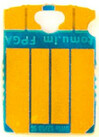

  

  <!--
  -->
  <!--
  -->
  <!--
  -->
  <!--
  -->

Hi, I'm Fomu!  [This workshop](https://workshop.fomu.im/) covers the basics of
Fomu in a top-down approach.  We'll start out by learning **what** Fomu is, **how to
load software** into Fomu, **how to write software** for Fomu and finally **how to
write hardware** for Fomu.

  
  

FPGAs are complex, weird things, so we'll take a gentle approach and start out
by treating it like a Python interpreter first, and gradually peel away layers
until we're writing our own hardware registers.  You can take a break at any
time and explore!  Stop when you feel the concepts are too unfamiliar, or
plough on and dig deep into the world of hardware.

The contents of this workshop is published at [workshop.fomu.im](https://workshop.fomu.im).

## Repository Contents

- [docs](./docs) - The actual workshop directions and content.
- [litex](./litex) - The files required for [the Migen / LiteX section of the
  workshop](https://workshop.fomu.im/en/latest/migen.html).
- [reference](./reference) - Extra reference documentation such as schematics
  and part datasheets.
- [riscv-blink](./riscv-blink) - The files required for the [Fomu as a RISC-V
  CPU section of the workshop](https://workshop.fomu.im/en/latest/riscv.html).
- [verilog](./verilog) - The files required for the [Verilog on Fomu section
  of the workshop](https://workshop.fomu.im/en/latest/verilog.html).

# Development

For guidelines about how to develop the workshop or how to build the workshop
locally, see [DEVELOPMENT](DEVELOPMENT.md).
