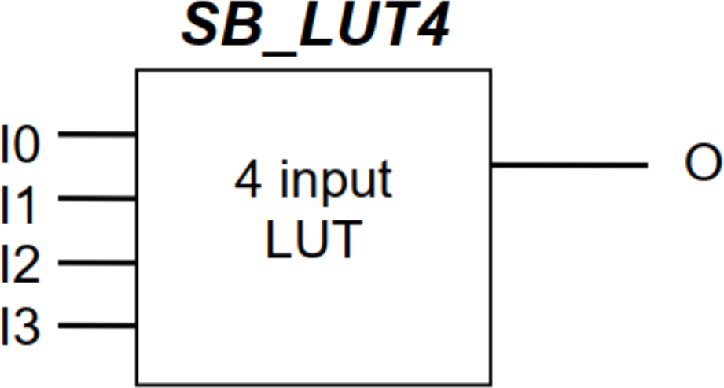
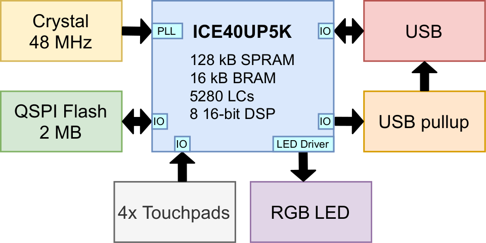

Background
----------

About FPGAs
~~~~~~~~~~~

Field Programmable Gate Arrays (FPGAs) are arrays of gates that are
programmable in the field. Unlike most chips you will encounter, which
have transistor gates arranged in a fixed order, FPGAs can change their
configuration by simply loading new code. Fundamentally, this code
programs lookup tables which form the basic building blocks of logic.

These lookup tables (called LUTs) are so important to the design of an
FPGA that they usually form part of the name of the part. For example,
Fomu uses a UP5K, which has about 5000 LUTs. NeTV used an LX9, which had
about 9000 LUTs, and NeTV2 uses a XC7A35T that has about 35000 LUTs.

This is the ``SB_LUT4``, which is the basic building block of Fomu. It
has four inputs and one output. To program Fomu, we must define what
each possible input pattern will create on the output.

To do this, we turn to a truth table:

+-----+-----+-----+-----+-----+-----+-----+-----+-----+-----+-----+-----+-----+-----+-----+-----+-----+
|     | 0   | 1   | 2   | 3   | 4   | 5   | 6   | 7   | 8   | 9   | 10  | 11  | 12  | 13  | 14  | 15  |
+=====+=====+=====+=====+=====+=====+=====+=====+=====+=====+=====+=====+=====+=====+=====+=====+=====+
| IO0 | 0   | 0   | 0   | 0   | 0   | 0   | 0   | 0   | 1   | 1   | 1   | 1   | 1   | 1   | 1   | 1   |
+-----+-----+-----+-----+-----+-----+-----+-----+-----+-----+-----+-----+-----+-----+-----+-----+-----+
| IO1 | 0   | 0   | 0   | 0   | 1   | 1   | 1   | 1   | 0   | 0   | 0   | 0   | 1   | 1   | 1   | 1   |
+-----+-----+-----+-----+-----+-----+-----+-----+-----+-----+-----+-----+-----+-----+-----+-----+-----+
| IO2 | 0   | 0   | 1   | 1   | 0   | 0   | 1   | 1   | 0   | 0   | 1   | 1   | 0   | 0   | 1   | 1   |
+-----+-----+-----+-----+-----+-----+-----+-----+-----+-----+-----+-----+-----+-----+-----+-----+-----+
| IO3 | 0   | 1   | 0   | 1   | 0   | 1   | 0   | 1   | 0   | 1   | 0   | 1   | 0   | 1   | 0   | 1   |
+-----+-----+-----+-----+-----+-----+-----+-----+-----+-----+-----+-----+-----+-----+-----+-----+-----+
| O   | *?* | *?* | *?* | *?* | *?* | *?* | *?* | *?* | *?* | *?* | *?* | *?* | *?* | *?* | *?* | *?* |
+-----+-----+-----+-----+-----+-----+-----+-----+-----+-----+-----+-----+-----+-----+-----+-----+-----+

For example, to create a LUT that acted as an AND gate, we would define
O to be 0 for everything except the last column. To create a NAND gate,
we would define O to be 1 for everything except the last column.

FPGA LUTs are almost always *n*-inputs to 1-output. The ICE family of
FPGAs from Lattice have 4-input LUTs. Xilinx parts tend to have 5- or
6-input LUTs which generally means they can do more logic in fewer LUTs.
Comparing LUT count between FPGAs is a bit like comparing clock speed
between different CPUs - not entirely accurate, but certainly a helpful
rule of thumb.

It is from this simple primitive that we build up the building blocks of
FPGA design.

Turning code into gates
^^^^^^^^^^^^^^^^^^^^^^^

Writing lookup tables is hard, so people have come up with abstract
Hardware Description Languages (HDLs) we can use to describe them. The
two most common languages are Verilog and VHDL. In the open source
world, Verilog is more common. However, a modern trend is to embed an
HDL inside an existing programming language, such as how Migen is
embedded in Python, or SpinalHDL is embedded in Scala.

Here is an example of a Verilog module:

.. code:: verilog

   module example (output reg [0:5] Q, input C);
       reg [0:8] counter;
       always @(posedge C)
       begin
           counter <= counter + 1'b1;
           Q <= counter[3] ^ counter[5] | counter<<2;
       end
   endmodule

We can run this Verilog module through a synthesizer to turn it into
``SB_LUT4`` blocks, or we can turn it into a more familiar logic
diagram:

.. image:: _static/verilog-synthesis.png
   :width: 100%
   :alt: A syntheis of the above logic into some gates

If we do decide to synthesize to ``SB_LUT4`` blocks, we will end up with
a pile of LUTs that need to be strung together somehow. This is done by
a Place-and-Route tool. This performs the job of assigning physical LUTs
to each LUT that gets defined by the synthesizer, and then figuring out
how to wire it all up.

Once the place-and-route tool is done, it generates an abstract file
that needs to be translated into a format that the hardware can
recognize. This is done by a bitstream packing tool. Finally, this
bitstream needs to be loaded onto the device somehow, either off of a
SPI flash or by manually programming it by toggling wires.

About the ICE40UP5K
~~~~~~~~~~~~~~~~~~~

We will use an ICE40UP5K for this workshop. This chip has a number of
very nice features:

1. 5280 4-input LUTs (LC)
2. 16 kilobytes BRAM
3. **128 kilobytes “SPRAM”**
4. Current-limited 3-channel LED driver
5. 2x I2C and 2x SPI
6. 8 16-bit DSP units
7. **Warmboot capability**
8. **Open toolchain**

Many FPGAs have what’s called block RAM, or BRAM. This is frequently
used to store data such as buffers, CPU register files, and large arrays
of data. This type of memory is frequently reused as RAM on many FPGAs.
The ICE40UP5K is unusual in that it also as 128 kilobytes of Single
Ported RAM that can be used as memory for a softcore (a term used for a
CPU core running inside an FPGA, to differentiate it from a ‘hard’ -
i.e. fixed chip - implementation). That means that, unlike other FPGAs,
valuable block RAM isn’t taken up by system memory.

Additionally, the ICE40 family of devices generally supports “warmboot”
capability. This enables us to have multiple designs live on the same
FPGA and tell the FPGA to swap between them.

As always, this workshop wouldn’t be nearly as easy without the open
toolchain that enables us to port it to a lot of different platforms.

About Fomu
~~~~~~~~~~

Fomu is an ICE40UP5K that fits in your USB port. It contains two
megabytes of SPI flash memory, four edge buttons, and a three-color LED.
Unlike most other ICE40 projects, Fomu implements its USB in a softcore.
That means that the bitstream that runs on the FPGA must also provide
the ability to communicate over USB. This uses up a lot of storage on
this small FPGA, but it also enables us to have such a tiny form factor,
and lets us do some really cool things with it.

The ICE40UP5K at the heart of Fomu really controls everything, and this
workshop is all about trying to unlock the power of this chip.
