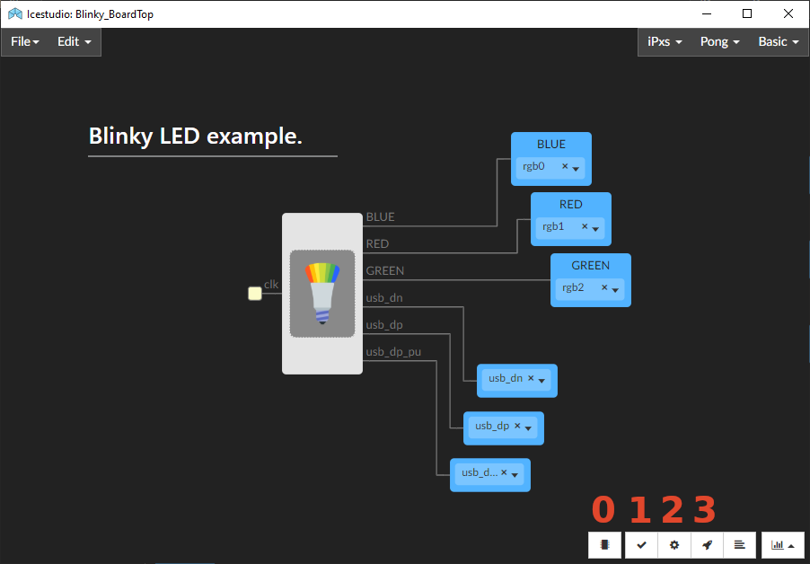
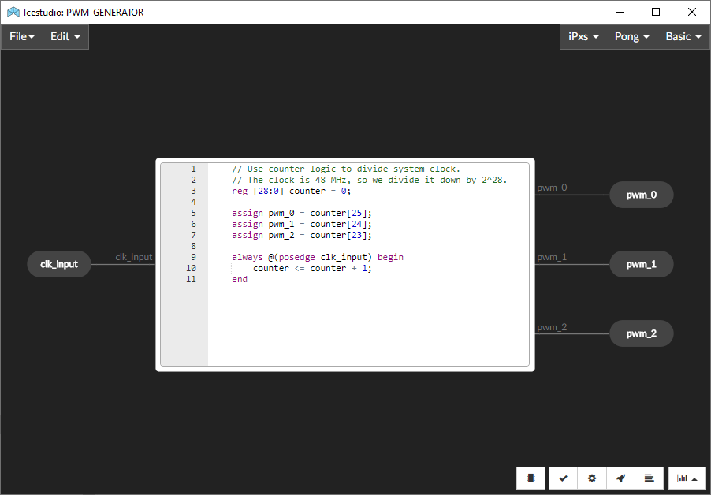

Fomu on IceStudio *Nightly*
---------------------------

.. IMPORTANT:: Fomu is currently not supported in the stable releases
  of IceStudio. Development or `nightly <https://github.com/juanmard/icestudio/releases/tag/nightly>`_
  releases need to be used.

“Hello world!” - Blink a LED
^^^^^^^^^^^^^^^^^^^^^^^^^^^^

The canonical “Hello, world!” of hardware is to blink a LED. The
directory ``icestudio`` contains a Blinky example in ICE format.
Moreover, ``Blinky_BoardTop.ice`` wraps Blinky, showcasing how
to use the Design Under Test (DUT) as a black box.

Open ``Blinky_BoardTop.ice`` from `Icestudio <https://juanmard.github.io/icestudio/>`_
and use the buttons at the botton:

0. Check that the **selected board** is the Fomu.

   - Click on the button with a 'microchip' icon, and a modal window will open.
   - There, select the device (UP5K) in the first dropdown list and the board (Fomu)
     in the second list.

1. Click on the **Verify** button for checking the design.
2. Click on the **Build** button for having the design exported to Verilog, synthesised,
   placed, routed and, finally, the bitstream generated.
3. Click on the **Upload** for sending the bitstream to the board.
4. After each of the steps is executed, the corresponding log can be shown through button
   **View command output**.

You should see the rainbow pattern in the Fomu as soon as the *Upload*
step is finished:

.. image:: _static/icestudio/blinky_video.gif
   :width: 600 px
   :align: center
   :target: https://github.com/juanmard/icestudio

However, that's just the beginning of the trip...

Navigation
==========

You can navigate the hierarchy of the design by double-clicking on the main
block. Go as deep as you want, until you find raw Verilog code. As you
can observe, ICE modules are fancy wrappers around the Verilog code from
``verilog/blink``.

.. image:: _static/icestudio/blinky.gif
   :width: 600 px
   :align: center

Editing submodules is blocked by default, but you can unlock the feature
with the red button at the botton left. Do the modifications you wish,
then save the changes and go back to the top. There is a 'Home' button
at the bottom left for jumping to the root of the design straightaway.
From the top, you can verify, build and upload the design again.

You can also open or save each of the blocks as an independent project.
For instance, open ``Blinky.ice``, instead of ``Blinky_BoardTop.ice``:

.. image:: _static/icestudio/blinky_diagram.png
   :width: 600 px
   :align: center

Modules are browsable, as shown in the screencast above:

.. image:: _static/icestudio/clk_buffering.png
   :width: 33%

.. image:: _static/icestudio/sb_rgba_drv.png
   :width: 33%

.. HINT:: Find more info about features of IceStudio (such as collections or
  plugins) in the `documentation <https://juanmard.github.io/icestudio/index.html>`_.

