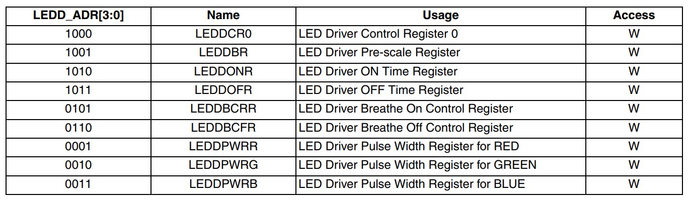

Python on Fomu
==============

You can load `MicroPython <https://micropython.org/>`__, a small Python
implementation, onto Fomu as an ordinary RISC-V binary. A precompiled
binary is located in the root of the Fomu workshop files.

Use ``dfu-util`` to load it:

.. session:: shell-session

   $ dfu-util -D micropython-fomu.dfu
   Copyright 2005-2009 Weston Schmidt, Harald Welte and OpenMoko Inc.
   Copyright 2010-2014 Tormod Volden and Stefan Schmidt
   This program is Free Software and has ABSOLUTELY NO WARRANTY
   Please report bugs to dfu-util@lists.gnumonks.org

   Opening DFU capable USB device...
   ID 1209:5bf0
   Run-time device DFU version 0101
   Claiming USB DFU Interface...
   Setting Alternate Setting #0 ...
   Determining device status: state = dfuIDLE, status = 0
   dfuIDLE, continuing
   DFU mode device DFU version 0101
   Device returned transfer size 1024
   $

.. tabs::

   .. group-tab:: MacOS X

        If you’re on a macOS machine, use the following command to connect to
        the device:

        .. session:: shell-session

           $ screen /dev/cu.usb*

   .. group-tab:: Linux

        If you’re on Linux, use the following command to connect to the device,
        it will be called ``ttyACM?``:

        .. session:: shell-session

           $ screen /dev/ttyACM*

   .. group-tab:: Windows

        If you’re running a version of Windows earlier than Windows 10, you will
        need to install a driver for the serial port. Open Zadag again and
        select ``Fomu`` from the dropdown list. Install the driver for
        ``USB Serial (CDC)``.

        You can then use a program such as `Tera Term
        <https://tera-term.en.lo4d.com/download>`__.

        .. session:: powershell

           PS> ttermpro.exe

        In Teraterm hit ``New Connection`` and select the ``Serial Port`` Radio
        Button. If it is greyed out you might have to change your USB Port
        driver for the Fomu.

        See `Working with Fomu <#working-with-fomu>`__,
        above.

You should be greeted with a MicroPython banner and REPL:

.. session:: pycon

   MicroPython v1.10-299-g8603316 on 2019-08-19; fomu with vexriscv
   >>>

This is a fully-functioning MicroPython shell. Try running some simple
commands such as ``print()`` and ``hex(9876+1234)``.

Fomu Python Extensions
----------------------

Fomu’s MicroPython binary contains a few extended Python modules that
you can use to interact with some of the hardware. For example, the RGB
LED has some predefined modes you can access. These are all located
under the ``fomu`` module.

Import the ``fomu`` module and access the ``rgb`` block to change the
mode to the predefined ``error`` mode:

.. session:: pycon

   >>> import fomu
   >>> rgb = fomu.rgb()
   >>> rgb.mode("error")
   >>>

We can also look at some information from the SPI flash, such as the SPI
ID. This ID varies between Fomu models, so it can be a good indication
of what kind of Fomu your code is running on:

.. session:: pycon

   >>> spi = fomu.spi()
   >>> hex(spi.id())
   '0xc2152815'
   >>>

Memory-mapped Registers
-----------------------

If we look at the generated Fomu header files (to be found for instance in
:repo:`riscv-blink <riscv-blink/include/generated/csr.h>`__), we can see
many, many memory-mapped registers. For example, the major, minor, and revision
numbers all have registers:

.. code:: cpp

   #define CSR_VERSION_MAJOR_ADDR 0xe0007000
   #define CSR_VERSION_MINOR_ADDR 0xe0007004
   #define CSR_VERSION_REVISION_ADDR 0xe0007008
   #define CSR_VERSION_MODEL_ADDR 0xe0007028

These are special areas of memory that don’t really exist. Instead, they
correspond to hardware. We can read these values using the ``machine``
class. Read out the major, minor, and revision codes from your Fomu.
They may be different from what you see here:

.. session:: pycon

   >>> import machine
   >>> machine.mem32[0xe0007000]
   2
   >>> machine.mem32[0xe0007004]
   0
   >>> machine.mem32[0xe0007008]
   3
   >>>

The ``CSR_VERSION_MODEL_ADDR`` contains a single character that
indicates what version of the hardware you have. We can convert this to
a character and print it out.

If you have a production board you will get ``P`` as shown below;

.. session:: pycon

   >>> chr(machine.mem32[0xe0007028])
   'P'
   >>>

If you have a hacker board you will get ``H`` as shown below;

.. session:: pycon

   >>> chr(machine.mem32[0xe0007028])
   'H'
   >>>

Memory-mapped RGB driver
~~~~~~~~~~~~~~~~~~~~~~~~

The blinking LED is actually a hardware block from Lattice. It has
control registers, and we can modify these registers by writing to
memory in Fomu. Some of these registers control things such as the
timing of the fade in and fade out pulses, and some control the level of
each of the three colors.

There is a wrapper in Fomu’s MicroPython that simplifies the process of
writing to these registers. The first argument is the register number,
and the second argument is the value to write.

For the ``LEDDPWR`` registers, the second argument determines the
brightness, value ranges from 0 to 255.

Try changing the color of the three LEDs:

.. session:: pycon

   >>> ADDR_RED_LED_PULSE_WIDTH   = 0b0001 # LEDDPWRR
   >>> ADDR_GREEN_LED_PULSE_WIDTH = 0b0010 # LEDDPWRG
   >>> ADDR_BLUE_LED_PULSE_WIDTH  = 0b0011 # LEDDPWRB
   >>> rgb.write_raw(ADDR_RED_LED_PULSE_WIDTH, 255)  # Red LED fully on
   >>> rgb.write_raw(ADDR_GREEN_LED_PULSE_WIDTH, 14) # Green LED mostly off
   >>> rgb.write_raw(ADDR_BLUE_LED_PULSE_WIDTH, 1)   # Blue LED off
   >>>

The color should change immediately. More information on these registers
can be found in the `ICE40 LED Driver Usage Guide <_static/reference/FPGA-TN-1288-ICE40LEDDriverUsageGuide.pdf>`__.
