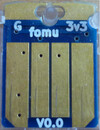

.. |Foboot Version| replace:: v2.0.3

Requirements
------------

For this workshop you will need;

#. The Fomu workshop files - see :ref:`required-files` section.
#. The Fomu toolchain - see :ref:`required-software` section.
#. A Fomu board - see :ref:`required-hardware` section.
#. Set up drivers - see :ref:`required-drivers` section.

.. note::

    If you are at a workshop, please **install the tools first** and then get
    the hardware from your presenter.

.. warning::

    Your Fomu should be running Foboot |Foboot Version| or newer.

    You can see what version you are running by typing ``dfu-util -l`` like so;

    .. session:: shell-session
        :emphasize-lines: 9

        $ dfu-util -l
        dfu-util 0.9

        Copyright 2005-2009 Weston Schmidt, Harald Welte and OpenMoko Inc.
        Copyright 2010-2016 Tormod Volden and Stefan Schmidt
        This program is Free Software and has ABSOLUTELY NO WARRANTY
        Please report bugs to http://sourceforge.net/p/dfu-util/tickets/

        Found DFU: [1209:5bf0] ver=0101, devnum=19, cfg=1, intf=0, path="1-2", alt=0, name="Fomu PVT running DFU Bootloader v2.0.3", serial="UNKNOWN"
        $

    If your Fomu is running an version older than |Foboot Version| follow the
    :ref:`bootloader-update` section.

.. _required-files:

Required Files
~~~~~~~~~~~~~~

You will need the Workshop files. They are located in the
`fomu-workshop <https://github.com/im-tomu/fomu-workshop>`__ Github
repository. You can download
`master.zip <https://github.com/im-tomu/fomu-workshop/archive/master.zip>`__
or clone it from git:

.. session:: shell-session

   $ git clone --recurse-submodules https://github.com/im-tomu/fomu-workshop.git
   Cloning into 'fomu-workshop'...
   remote: Enumerating objects: 140, done.
   remote: Counting objects: 100% (140/140), done.
   remote: Compressing objects: 100% (93/93), done.
   remote: Total 871 (delta 87), reused 94 (delta 46), pack-reused 731
   Receiving objects: 100% (871/871), 6.22 MiB | 1.46 MiB/s, done.
   Resolving deltas: 100% (468/468), done.
   Submodule 'litex/deps/litedram' (https://github.com/enjoy-digital/litedram.git) registered for path 'litex/deps/litedram'
   Submodule 'litex/deps/litescope' (https://github.com/enjoy-digital/litescope.git) registered for path 'litex/deps/litescope'
   Submodule 'litex/deps/litex' (https://github.com/enjoy-digital/litex.git) registered for path 'litex/deps/litex'
   Submodule 'litex/deps/litex_boards' (https://github.com/litex-hub/litex-boards.git) registered for path 'litex/deps/litex_boards'
   Submodule 'litex/deps/migen' (https://github.com/m-labs/migen.git) registered for path 'litex/deps/migen'
   Submodule 'litex/deps/pyserial' (https://github.com/pyserial/pyserial.git) registered for path 'litex/deps/pyserial'
   Submodule 'litex/deps/valentyusb' (https://github.com/im-tomu/valentyusb.git) registered for path 'litex/deps/valentyusb'
   ...
   remote: Enumerating objects: 78, done.
   remote: Counting objects: 100% (78/78), done.
   remote: Compressing objects: 100% (71/71), done.
   remote: Total 78 (delta 2), reused 78 (delta 2), pack-reused 0
   Receiving objects: 100% (78/78), 10.88 MiB | 3.86 MiB/s, done.
   Resolving deltas: 100% (2/2), done.
   Submodule path 'litex/deps/litex/litex/soc/cores/cpu/vexriscv/verilog/ext/VexRiscv/src/test/resources/VexRiscvRegressionData': checked out '539398c1481203a51115b5f1228ea961f0ac9bd3'
   Submodule path 'litex/deps/litex/litex/soc/software/compiler_rt': checked out '81fb4f00c2cfe13814765968e09931ffa93b5138'
   Submodule path 'litex/deps/litex_boards': checked out '91083f99a8551c3465aaf3d6130268c7f7f24a50'
   Submodule path 'litex/deps/migen': checked out '562c0466443f859d6cf0c87a0bb50db094d27cf4'
   Submodule path 'litex/deps/pyserial': checked out 'acab9d2c0efb63323faebfd5e3405d77cd4b5617'
   Submodule path 'litex/deps/valentyusb': checked out 'b34852eb2e77bd9d04ebc3e6e8454cf6d93a02fb'
   $

.. note::

   If you’re attending a workshop that provides USB drives, these files may be
   available on the USB drive under the ``Workshop`` directory.

.. _required-software:

Required Software
~~~~~~~~~~~~~~~~~

Fomu requires specialized software. This software is provided for Linux
x86/64, macOS, and Windows, via
`Fomu Toolchain <https://github.com/im-tomu/fomu-toolchain/releases/latest>`__.

Debian packages are also
`available for Raspberry Pi <https://github.com/im-tomu/fomu-raspbian-packages>`__.

If you’re taking this workshop as a class, the toolchains are provided
on the USB disk.

To install the software, extract it somewhere on your computer, then
open up a terminal window and add that directory to your PATH:

.. tabs::

   .. group-tab:: MacOS X

      .. session:: shell-session

         $ export PATH=[path-to-toolchain]/bin:$PATH

   .. group-tab:: Linux

      .. session:: shell-session

         $ export PATH=[path-to-toolchain]/bin:$PATH

   .. group-tab:: Windows

      If you use PowerShell as your terminal;

      .. session:: ps1con

         PS> $ENV:PATH = "[path-to-toolchain]\bin;" + $ENV:PATH

      If you use ``cmd.exe`` as your terminal;

      .. session:: doscon

         C:\> PATH=[path-to-toolchain]\bin;%PATH%

To confirm installation, run the ``yosys`` command and confirm you get
the following output;

.. code:: sh
   :emphasize-lines: 22

   $ yosys

    /----------------------------------------------------------------------------\
    |                                                                            |
    |  yosys -- Yosys Open SYnthesis Suite                                       |
    |                                                                            |
    |  Copyright (C) 2012 - 2018  Clifford Wolf <clifford@clifford.at>           |
    |                                                                            |
    |  Permission to use, copy, modify, and/or distribute this software for any  |
    |  purpose with or without fee is hereby granted, provided that the above    |
    |  copyright notice and this permission notice appear in all copies.         |
    |                                                                            |
    |  THE SOFTWARE IS PROVIDED "AS IS" AND THE AUTHOR DISCLAIMS ALL WARRANTIES  |
    |  WITH REGARD TO THIS SOFTWARE INCLUDING ALL IMPLIED WARRANTIES OF          |
    |  MERCHANTABILITY AND FITNESS. IN NO EVENT SHALL THE AUTHOR BE LIABLE FOR   |
    |  ANY SPECIAL, DIRECT, INDIRECT, OR CONSEQUENTIAL DAMAGES OR ANY DAMAGES    |
    |  WHATSOEVER RESULTING FROM LOSS OF USE, DATA OR PROFITS, WHETHER IN AN     |
    |  ACTION OF CONTRACT, NEGLIGENCE OR OTHER TORTIOUS ACTION, ARISING OUT OF   |
    |  OR IN CONNECTION WITH THE USE OR PERFORMANCE OF THIS SOFTWARE.            |
    |                                                                            |
    \----------------------------------------------------------------------------/

    Yosys 78b30bbb1102047585d1a2eac89b1c7f5ca7344e (Fomu build) (git sha1 41d9173, gcc 5.5.0-12ubuntu1~14.04 -fPIC -Os)

   yosys>

Ensure it says **(Fomu build)**. Type ``exit`` to quit ``yosys``.

.. note::

   The `Fomu Toolchain <https://github.com/im-tomu/fomu-toolchain/releases/latest>`__
   consists of the following tools;

   ============================================================= =============================================
   Tool                                                          Purpose
   ============================================================= =============================================
   `yosys <https://github.com/YosysHQ/yosys>`__                  Verilog synthesis
   `nextpnr-ice40 <https://github.com/YosysHQ/nextpnr>`__        FPGA place-and-route
   `icestorm <https://github.com/cliffordwolf/icestorm>`__       FPGA bitstream packing
   `riscv toolchain <https://www.sifive.com/boards/>`__          Compile code for a RISC-V softcore
   `dfu-util <https://dfu-util.sourceforge.net/>`__              Load a bitstream or code onto Fomu
   `python <https://python.org/>`__                              Convert Migen/Litex code to Verilog
   `wishbone-tool <https://github.com/xobs/wishbone-utils/>`__   Interact with Fomu over USB
   **serial console**                                            Interact with Python over a virtual console
   ============================================================= =============================================

.. _required-hardware:

Required Hardware
~~~~~~~~~~~~~~~~~

For this workshop, you will need a Fomu board.

Aside from that, you need a computer with a USB port that can run the
:ref:`required-software`.

You should not need any special drivers, though on Linux you may need sudo
access, or special udev rules to grant permission to use the USB device from a
non-privileged account.

This workshop may be competed with any model of Fomu, though there are some
parts that require you to identify which model you have. See the
:ref:`which-fomu` section.

.. _which-fomu:

Which Fomu do I have?
~~~~~~~~~~~~~~~~~~~~~

+-------------------+-------------------------------------------------------------------------+-------------------------------------------------------------------+
|                   | Hacker                                                                  | Production                                                        |
+===================+=========================================================================+===================================================================+
| **String**        | hacker                                                                  | pvt                                                               |
+-------------------+-------------------------------------------------------------------------+-------------------------------------------------------------------+
| **Bash Command**  | ``export FOMU_REV=hacker``                                              | ``export FOMU_REV=pvt``                                           |
+-------------------+-------------------------------------------------------------------------+-------------------------------------------------------------------+
| **Front**         | |Hacker Hardware Front without case|                                    | |Production Hardware Front without case|                          |
+-------------------+-------------------------------------------------------------------------+-------------------------------------------------------------------+
| **Back**          | |Hacker Hardware Back without case|                                     | |Production Hardware Back without case|                           |
+-------------------+-------------------------------------------------------------------------+-------------------------------------------------------------------+
| **In Case**       | |Hacker Hardware Back with case|                                        | |Production Hardware Back with case|                              |
+-------------------+-------------------------------------------------------------------------+-------------------------------------------------------------------+
| **Parts**         | |Hacker Hardware Annotated Diagram|                                     | |Production Hardware Annotated Diagram|                           |
+-------------------+-------------------------------------------------------------------------+-------------------------------------------------------------------+
| **Color**         | |Dark Blue|                                                             | |Cyan Light Blue|                                                 |
+-------------------+-------------------------------------------------------------------------+-------------------------------------------------------------------+
| **Bootloader**    | Fomu **Hacker** running DFU Bootloader vX.X.X                           | Fomu **PVT** running DFU Bootloader vX.X.X                        |
+-------------------+-------------------------------------------------------------------------+-------------------------------------------------------------------+
| **Description**   | These are the original design and cut corners to make it easier to      | If you ordered a Fomu from Crowd Supply, this is the model you'll |
|                   | manufacture. If you received one directly from Tim before 36C3, you     | receive. It is small, and fits in a USB port. There is no         |
|                   | probably have one of these. Hacker boards have white silkscreen on      | silkscreen on it. This model of Fomu has a large silver crystal   |
|                   | the back.                                                               | oscillator that is the tallest component on the board.            |
+-------------------+-------------------------------------------------------------------------+-------------------------------------------------------------------+
| **Received at**   | From Tim at 35C3, CCCamp19, HackADay Supercon 2019                      | At RISC-V Summit 2019, 36C3, Crowdsupply, Mouser                  |
+-------------------+-------------------------------------------------------------------------+-------------------------------------------------------------------+
| **Buy more**      | End of Life                                                             | `CrowdSupply <https://j.mp/fomu-cs>`__,                           |
+-------------------+-------------------------------------------------------------------------+-------------------------------------------------------------------+

.. |Dark Blue| raw:: html

    dark blue

.. |Cyan Light Blue| raw:: html

    cyan / light blue

.. |Production Hardware Front without case| image:: ../img/hw-pvt-front-bare-small.jpg
.. |Hacker Hardware Back without case| image:: ../img/hw-hacker-back-bare-small.jpg
.. |Production Hardware Back without case| image:: ../img/hw-pvt-back-bare-small.jpg
.. |Hacker Hardware Back with case| image:: ../img/hw-hacker-back-case-small.jpg
.. |Production Hardware Back with case| image:: ../img/hw-pvt-back-case-small.jpg
.. |Hacker Hardware Annotated Diagram| image:: ../img/hw-hacker-annotated.png
.. |Production Hardware Annotated Diagram| image:: ../img/hw-pvt-annotated.png

.. note::

   There are also Fomu EVT boards which were shipped to early backers of
   the Fomu crowd funding campaign. This model of Fomu is about the size
   of a credit card. It should have the text “Fomu EVT3” written across
   it in white silkscreen. If you have a different EVT board such as
   EVT2 or EVT1, they should work also.

.. _required-drivers:

Required Drivers
~~~~~~~~~~~~~~~~

On most systems the Fomu board does **not** need any special drivers.

* On Windows 10 or newer you do not need to install anything.
* On Windows systems **earlier** than Windows 10 you will need to
  :ref:`windows-zadig`.
* On MacOS X you do not need to install any drivers.
* On Linux you do not need to install any drivers, **however** you may need
  ``sudo`` access unless you :ref:`linux-udev` to grant permission to use the
  USB device from a non-privileged account.

.. _linux-udev:

Setup udev rules
++++++++++++++++

.. warning::

   This set up is for Linux **only**.

   Setting up these udev rules grant permissions to use the USB device from a
   non-privileged account.

In Linux, try running ``dfu-util -l``, and if you get an error message like the
following you should add a ``udev`` rule as to give your user permission to the
usb device.

.. session:: shell-session

   $ dfu-util -l
   dfu-util 0.9

   Copyright 2005-2009 Weston Schmidt, Harald Welte and OpenMoko Inc.
   Copyright 2010-2016 Tormod Volden and Stefan Schmidt
   This program is Free Software and has ABSOLUTELY NO WARRANTY
   Please report bugs to http://sourceforge.net/p/dfu-util/tickets/

   dfu-util: Cannot open DFU device 1209:5bf0
   $

Steps to set up udev rule
+++++++++++++++++++++++++

#. Add your user to the plugdev group

   .. session:: shell-session

      $ sudo groupadd plugdev
      $ sudo usermod -a -G plugdev $USER

#. You **will** need to log out and log in again in order to be a member of the ``plugdev`` group.

#. Check you are in the ``plugdev`` group with ``id $USER``

   .. session:: shell-session

      $ id $USER
      uid=1000(tim) gid=1000(tim) groups=500(plugdev),997(admin)
      $

#. Create a file named ``/etc/udev/rules.d/99-fomu.rules`` and add the following:

   .. code:: udev

      SUBSYSTEM=="usb", ATTRS{idVendor}=="1209", ATTRS{idProduct}=="5bf0", MODE="0664", GROUP="plugdev"

#. Reload the udev-rules using the following:

   .. session:: shell-session

      $ sudo udevadm control --reload-rules
      $ sudo udevadm trigger

.. _windows-zadig:

Installing Zadig Drivers
++++++++++++++++++++++++

.. warning::

   This set up is only needed for Windows system **earlier** than Windows 10.

#. Download `Zadig <https://zadig.akeo.ie/>`__.
#. Open Zadig.
#. Under Options, select "List All Devices".
#. In the dropdown, select your Fomu and in the field right of the green arrow
   choose the `WinUSB` driver and hit Upgrade Driver.

   .. image:: ../img/Zadeg-Setup.PNG
      :alt: Setup of ZADEG for Updating USBport driver on WIN7

